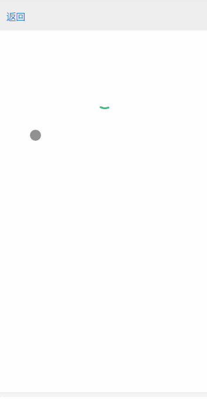

## 项目介绍

这是一个基于vue, vue-router, vue-resource, express来实现的简单的电影网站，后台调用的是豆瓣电影api接口
- [豆瓣v2-api](https://developers.douban.com/wiki/?title=movie_v2#review)
- [电影评论api接口](https://api.douban.com/v2/movie/subject/${this.id}/reviews?apikey=0b2bdeda43b5688921839c8ecb20399b&start=0&count=20&client=something&udid=dddddddddddddddddddddd)  由于豆瓣影评接口需要开发者注册，便到网上找了一个别人注册好的


## 运行项目

- 克隆整个项目到本地
```
clone https://github.com/wohaiwo/vue-douban.git
```

- 进入项目中，并安装依赖
```
npm install
```

- 打开浏览器，输入**127.0.0.1:8080**
```
npm run dev
```

## 项目截图


## 代做事项

- 每次F5重新加载页面时，会出现static文件下的reset.css无法加载的情况
- 各个组件中的api并没有完全分离，需要抽离出一个api.js
- 页面基本样式优化
- 添加本地存储，防止多次加载相同数据
